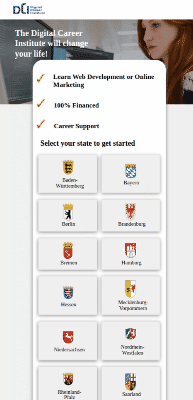

# DCI Clone Responsive website
## Desktop

## Mobile

#### Navigation

- About Project
  - _i cloned DCI Institute website_
- How to use this Project
  - _In The Main we will have the Description of the website , the when we scroll down we find the Kind of courses we have, then the Footer and the contacts_
  - _Developed With_
- Contact
  - _Mail_
  - _GitHub_
  - _LinkedIn_
- Used Tools
  - _Fonts_
  - _Design_
  - _Icons_
  - _Colors_

---

##### Developed With

- [x] _HTML5_
- [ ] _CSS3_
- [x] _SASS_
- [x] _SCSS_
- [ ] _JavaScript_
- [ ] _React_
- [ ] _Bootstrap_
- [x] _npm_
- [ ] _..._

---

### Contact

Mail: [myEmail](mailto:anwart256@gmail.com) 
GitHub: [yourGHName](https://github.com/atakriti) 
LinkedIn: [your linkedIn](#)

---

### Used Tools

- [icons](https://)
- [npm](https://www.npmjs.com/)
- [Google Fonts](https://fonts.google.com/)
- [Visual Studio Code](https://code.visualstudio.com/)

---